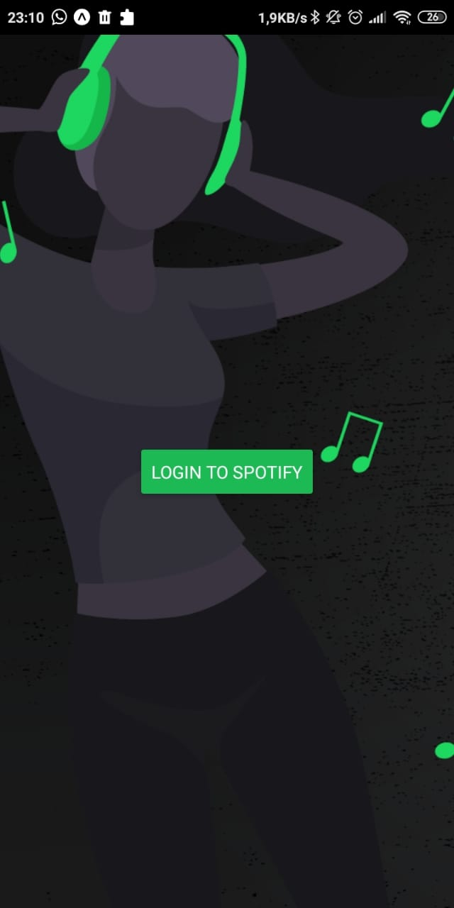
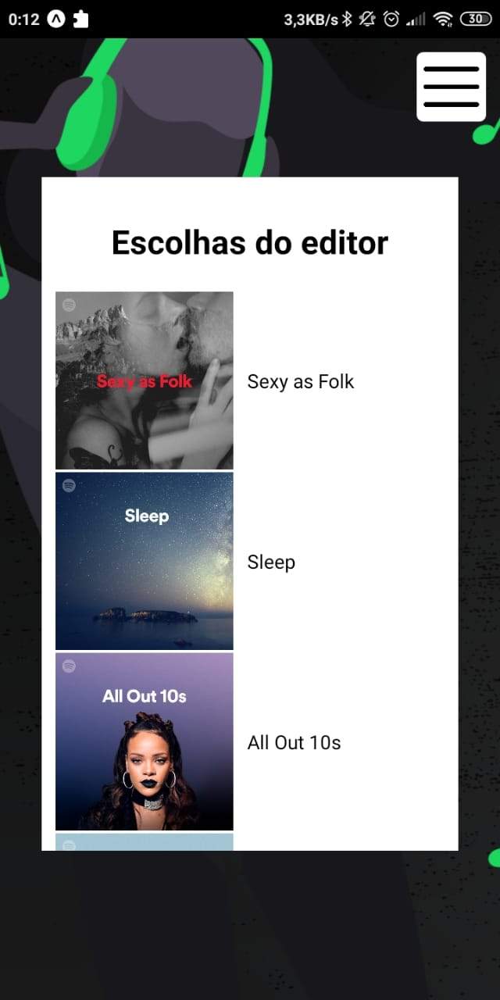
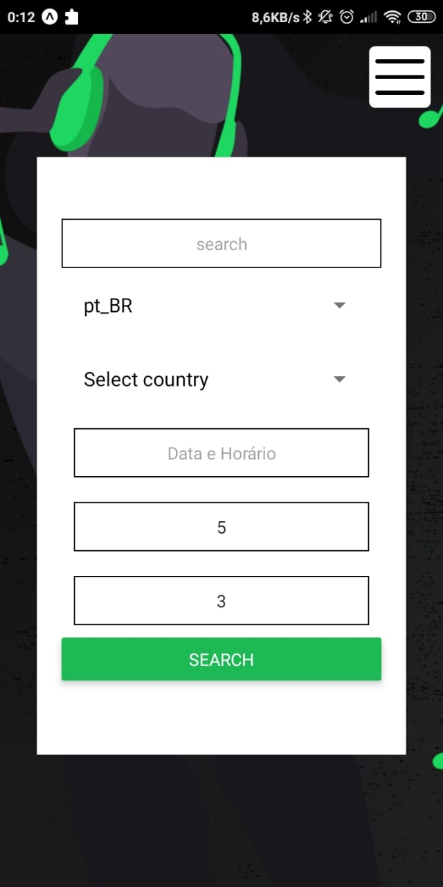

# SPOTIFY MOBILE

<p align="center">
  <a href="https://github.com/thedarkzeno">
        
    </a>
  
</p>


> Search by playlists with a simple interface

<p align="center"></p>
<p align="center"></p>
<p align="center"></p>


## Summary 

- [Overview ](#eyes-overview)

- [Pre requisites](#warning-pre-requisites)

- [How to run](#construction_worker-how-to-run)

- [Dependencies](#books-dependecies)

- [License](#license)

## :eyes: Overview 

<p align="justify">
  With Spotify-MOBILE you can search for spotify playlists.
</p>


## :warning: Pre requisites

- [Node](https://nodejs.org/en/download/)


## :construction_worker: How to run:

First, you need a valid client id of the [spotify](https://www.spotify.com/), you can create one [here](https://developer.spotify.com/dashboard/applications).

Clone the project from github:

```shell
git clone https://github.com/thedarkzeno/spotify-mobile
cd spotify-mobile
```

Change de CLIENT ID inside the file `config.js`

```shell
yarn
# or
npm i
```

Start the application:

```shell
expo start
```

## :books: Dependencies 

- [React Natine](https://reactnative.dev/docs/getting-started)
- [Expo](https://docs.expo.io/)
- [React Navigation](https://reactnavigation.org/docs/getting-started)
- [Redux](https://redux.js.org/)
- [Axios](https://github.com/axios/axios)


## License

The [MIT License]() (MIT)


---

<p align="center">
Made with :heart: by <a href="https://www.linkedin.com/in/adalberto-junior-62618a176/">Adalberto</a>
</p>

